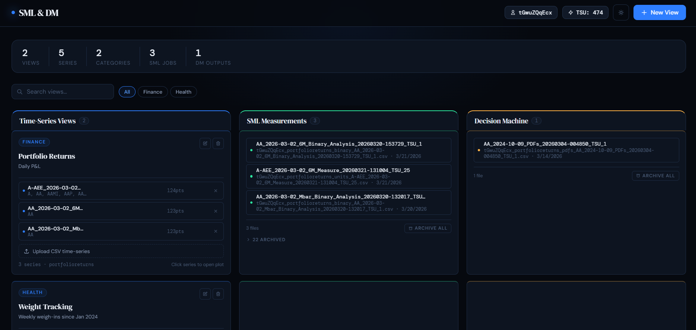
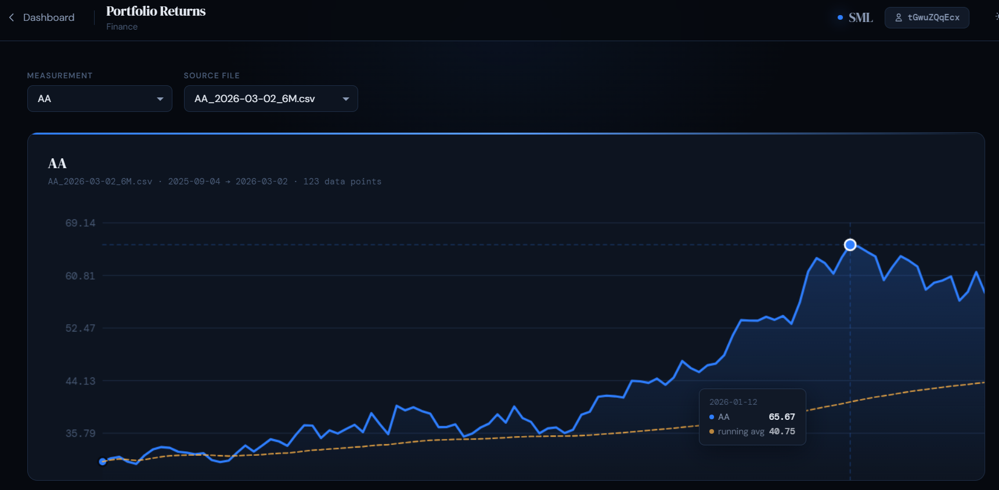
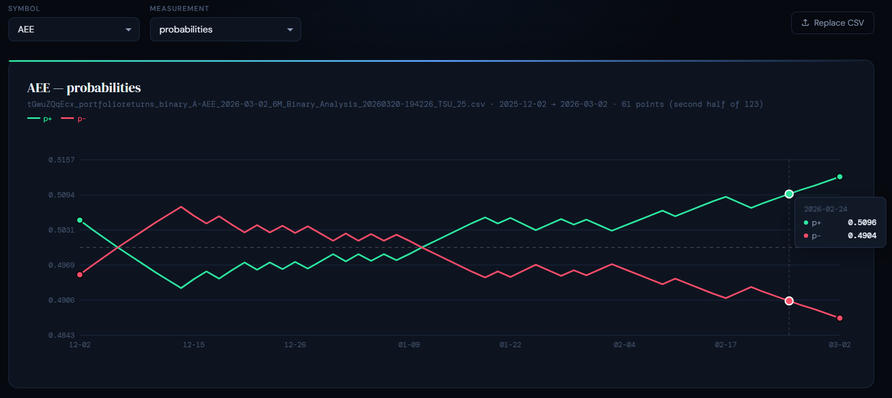

# Decision Machine

**Scientific Machine Learning for time-series data — rigorous, transparent, defensible decisions.**

Decision Machine is a system for uploading, visualizing, and submitting time-series data for Scientific Machine Learning analysis. SML-App is the local desktop client for Windows — your data never leaves your machine except during processing, and even then it is encrypted in transit and deleted from AWS infrastructure immediately after.

---

## What it does

```
Upload a time-series CSV  →  Review in the plot viewer  →  Submit for SML processing  →  Explore results
```

- **Views** — organize your time-series data into named views with categories and notes
- **Measurements** — interactive time-series plotter with date range selection
- **SML Processing** — submit Binary or Units analysis jobs; results appear automatically when ready
- **Decision Machine** — tabular viewer for DM output files
- **File management** — archive, restore, and delete output files directly from the dashboard

---

## Screenshots

| Dashboard | Job Plot | Measurements |
|-----------|----------|--------------|
|  |  |  |

---

## Getting started

### Option 1 — Get a personalised build (recommended)

SML-App is distributed as a personalised Windows executable. Each build is configured with your unique customer ID and email for TSU billing.

**[→ Register to get your copy](https://decision-machine.com/register)**

You'll receive an email with a download link within minutes.

### Option 2 — Build from source

Requirements: Python 3.11+, AWS CLI configured with appropriate credentials.

```bash
git clone https://github.com/mtempler/decision-machine
cd sml-app
pip install flask boto3
python server.py
```

Open `http://localhost:5000` in your browser.

To build a distributable `.exe`:

```bash
pip install pyinstaller
build.bat {your-custid} {your-email}
```

---

## How it works

SML-App runs a local Flask server on `localhost:5000`. Your time-series CSVs are stored on your machine in `input/`. When you submit a job:

1. The data file (header stripped) and a metadata `.ini` file are uploaded to AWS S3
2. A Lambda function processes the data and writes results back to S3
3. A background agent on your machine downloads the results automatically
4. Results appear in the dashboard within minutes

**Your raw data never persists in the cloud.** Input files are deleted by Lambda immediately after processing.

---

## Requirements

- Windows 10 or later (macOS support planned)
- AWS CLI configured (`~/.aws/credentials`) — for CLI auth mode
- Active internet connection for SML processing and TSU billing
- No internet required for local Views, plotting, and data management

---

## TSU Billing

SML processing is metered in **Time-Series Units (TSUs)**:

- 1 TSU = 1 time-series processed with fewer than 250 timestamps
- Cost: **$0.10 USD per TSU**
- Purchase TSUs from within the app — invoice sent to your registered email
- Balance displayed in the header; jobs blocked if unfunded

---

## Data privacy

| Data | Where it lives | Retention |
|------|----------------|-----------|
| Raw time-series CSVs | Your machine only | Until you delete them |
| Processing input | AWS S3 `OnDemand/` | Deleted immediately after processing |
| Processing output | AWS S3 + your machine | Until you delete them |
| Your email | SML-App config + invoice request | Invoice request deleted after processing |

No analytics, no telemetry, no third-party data sharing.

---

## Configuration

`sml-app.config` (created at first launch, lives next to the `.exe`):

```ini
[identity]
custid    = your-customer-id
auth_mode = cli          ; cli | cognito
email     = you@example.com

[storage]
input_bucket   = customer.decision-machine.com
output_bucket  = output.customer.decision-machine.com
watch_path     = downloads
watch_interval = 30
agent_interval = 60
```

---

## IAM policy (CLI mode)

Your AWS credentials need the following permissions:

```json
{
  "Version": "2012-10-17",
  "Statement": [
    {
      "Effect": "Allow",
      "Action": ["s3:PutObject"],
      "Resource": "arn:aws:s3:::customer.decision-machine.com/OnDemand/*"
    },
    {
      "Effect": "Allow",
      "Action": ["s3:GetObject", "s3:ListBucket"],
      "Resource": [
        "arn:aws:s3:::output.customer.decision-machine.com",
        "arn:aws:s3:::output.customer.decision-machine.com/{your-custid}/*"
      ]
    }
  ]
}
```

---

## Roadmap

- [ ] Cognito authentication (no AWS CLI required)
- [ ] macOS support
- [ ] Web registration portal
- [ ] Daily TSU reconciliation
- [ ] Job status tracking (pending / processing / complete)

---

## Contributing

Issues and pull requests welcome. For questions about the SML processing pipeline or billing, contact [support@decision-machine.com](mailto:support@decision-machine.com).

---

## License

MIT License — see [LICENSE](LICENSE) for details.

The SML processing Lambda functions and Decision Machine infrastructure are proprietary and not included in this repository.
"# decision-machine" 
